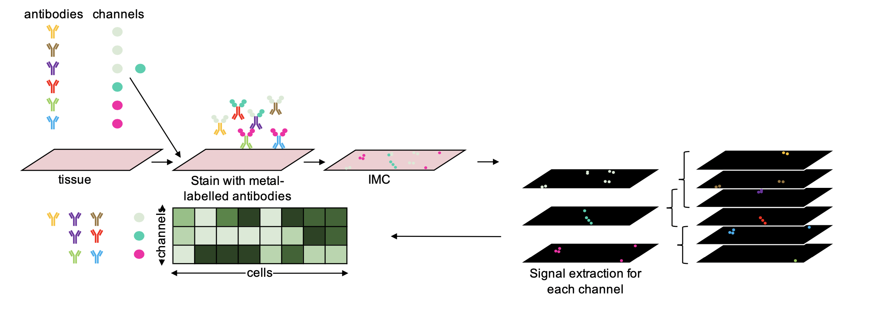
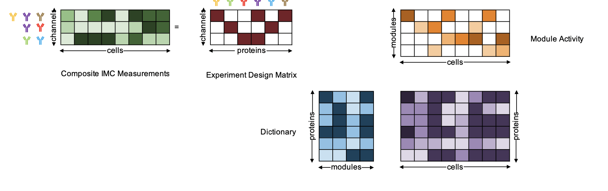

<!-- Back to top link -->
<a name="readme-top"></a>




<div align="center">
  <p align="center">
    CISI for IMC Data Overview
  </p>
</div>


<!-- ABOUT THE PROJECT -->
## About The Project



This projects adapts the code from the paper [“Compressed sensing for highly efficient imaging transcriptomics.”](https://www.ncbi.nlm.nih.gov/pmc/articles/PMC8355028/)
published in 2021 in Nature biotechnology by Cleary, Brian et al. to IMC data.
<br />
The core idea of the paper is that we can use compressed sensing to recover individual
protein expression levels from composite measurements (e.g. using the same channel/metal-isotop
to measure multiple proteins). The advantage is that we need less channels overall
to measure the same amount of proteins as in a normal IMC run.
<br />
For more information on the steps of CISI for IMC and how it works, go to
<a href="#usage">Usage</a>.


<p align="right">(<a href="#readme-top">back to top</a>)</p>


### Built With

* [conda](https://www.anaconda.com/)
* [renv](https://rstudio.github.io/renv/articles/renv.html)
* [snakemake](https://snakemake.readthedocs.io/en/stable/)


<p align="right">(<a href="#readme-top">back to top</a>)</p>


<!-- GETTING STARTED -->
## Getting Started

This project contains the code to run CISI on IMC data and to run a parameter sweep
useful for the setup of a composite experiment.
<br />
(All the scripts used to analysis the code are present in [analysis/](https://github.com/BodenmillerGroup/CISI_IMC/tree/main/analysis) and the resulting .html files in
[results/reports](https://github.com/BodenmillerGroup/CISI_IMC/tree/main/results/reports)
or available on the [website](https://bodenmillergroup.github.io/CISI_IMC/))

To get a local copy up and running follow these simple example steps.

### Prerequisites

To download the environment with all the necessary python packages to run the CISI
code, as well as to run snakemake for the parameter sweep you need to download conda.

* [conda](https://conda.io/projects/conda/en/latest/user-guide/install/index.html)


<p align="right">(<a href="#readme-top">back to top</a>)</p>


### Installation

1. Clone the neccesary folders in the repo.

   ```sh
   git clone --depth 1 --no-checkout https://github.com/BodenmillerGroup/CISI_IMC.git
   cd CISI_IMC
   git sparse-checkout set code analysis/parameter_sweep
   git checkout
   ```

   **Note**
   If only interested in the CISI for IMC code and not the parameter sweep,
   `analysis/parameter_sweep` can be removed from `git sparse-checkout`

2. For downloading all the packages into a conda environment, follow instructions
   '1.'. If the CISI code is only accessed via the parameter sweep, there is the
   option of only installing a conda environment containing snakemake and then
   running the Snakefile for the parameter sweep using the --use-conda parameter.
   For this, follow option '2.'

    1. Install cisi_imc_env conda environment.

       ```sh
       conda env create -f cisi_imc_env.yml
       conda activate cisi_imc_env
       ```

    2. Install conda environment containing snakemake.

       ```sh
       conda create -n snakemake_env -c bioconda snakemake=7.17.1
       conda activate snakemake_env
       ```

       **Warning**
       When running the paramter-sweep, add parameters `--use-conda --conda-frontend conda`
       to the snakemake call.


<p align="right">(<a href="#readme-top">back to top</a>)</p>


<!-- USAGE EXAMPLES -->
## Usage

### CISI for IMC

As an input, CISI expects an anndata object, containing an expression matrix with
dimensions: cells x proteins. For this steinbock can be used to segment the IMC data,
and the results can then be read into an R SingleCellExperiment [please refer to IMCDataAnalysis](https://bodenmillergroup.github.io/IMCDataAnalysis/).
To convert the subsequent SingleCellExperiment to an anndata object the function
*writeH5AD()* from [zellkonverter](https://bioconductor.org/packages/release/bioc/html/zellkonverter.html) can be used.

The anndata object is used for training, validation and testing (split according to set
parameters). Additionally, there are a lot more parameters that can be set. The
most important parameters are listed underneath with an explanation of their function.
For a more complete list of parameters, please refer to the code of the function [train_dictionary_and_compositions.py](https://github.com/BodenmillerGroup/CISI_IMC/blob/main/code/train_dictionary_and_compositions.py).

The main function is the *train_U_and_A()* function, which takes the anndata object
and computes a dictionary U, a experiment design matrix A/Phi and test statistics
from simulated data using part of the training data kept solely for testing purposes.

```sh
(training_res, training_res_no_noise,
U_best, Phi_best, X_test) = train_U_and_A(anndata_object,   
                                          outpath,
                                          split_by='roi',  
                                          k_cv=4,
                                          test_set=('name_of_test_rois'),
                                          lda1=3,
                                          normalization='paper_norm',
                                          d=80,
                                          nmeasurements=10,
                                          maxcomposition=3,
                                          save='no_noise',
                                          analysis_normalization=True,
                                          best_A_method='mean')
```

* **X_input:** anndata object containing numpy array X (cells x proteins)
         Will be divided into: training, validate and test set
* **outpath:** Specify where output files should be saved to (used in all fnc)
* **split_by:** either split by 'roi' or 'percentage' (default: 'roi')
* **k_cv:** number k cross-validations (default: 4)
            if split_by='roi, k_cv needs to be smaller and a multiple of the
            number of rois (not including the test roi)
* **test_set:** tuple of rois used as test sets with the same names as in
                the anndata object column sample_id
                (if split_by='roi', then test_set must be set and test_size
                can't be used)
* **lda1:** (in mode 1) the number of nonzeros per column in W, also called sparsity (k)
* **normalization:** How data is normalized before running smaf (default: paper_norm)
                     Options: paper_norm (normalization used in paper, protein-wise),
                     min_max_norm (protein-wise) or none (from initial analysis
                     recommended)
* **d:** the number of features (columns) in the dictionary U
* **nmeasurements:** number of channels (# rows of A) (default: 10)
* **maxcomposition:** maximum times each gene is represented (mode G),
                      or max genes per composition (mode M)
                      (default: 3)
* **analysis_normalization:** If true then normalization is used before simulating
                              decomposed data and is compared to true data normalized
                              the same way (default: True)
* **best_A_method:** Method to evaluate best A/Phi
                     'min', best A chosen according to highest worst performing
                            protein measured by protein-wise pearson correlation
                     'mean', best A chosen according to highest mean protein-wise
                             pearson correlation (default)
* **save:** Which decomposed X is saved.
            Either the X decomposed from noisy simulated data or simulated data
            without noise (default: no_noise)

A more comprehensive example script can be found [here](https://github.com/BodenmillerGroup/CISI_IMC/blob/main/analysis/helpers/CISI_for_IMC_training_example.ipynb).

This function will create in the specified output path several files. It creates
two files with result statistics from simulated data once adding noise and once
without any noise (simulation_results.txt, no_noise_simulation_results.txt), the decomposed anndata object from simulated data from either
noisy or without noise simulation as specified by the user (X_simulated_0.h5ad),
the ground truth anndata object subseted to the test set, e.g. the same cells as in the decomposed simulated anndata object (X_test.h5ad ), the computed dictionary U (gene_modules.csv),
the experiment design matrix A (version_*.txt), and two other files, which could be used to correct decomposed expression values (conditional_probability.csv, correlations.csv
has not been tested yet).

The *train_U_and_A()* calls on three functions: [*smaf()*](https://github.com/BodenmillerGroup/CISI_IMC/blob/main/code/compute_dictionary.py) to compute the dictionary U,
[*compute_A()*](https://github.com/BodenmillerGroup/CISI_IMC/blob/main/code/compute_random_compositions.py) to compute the best experiment design matrix and [*analyze_U_and_A()*](https://github.com/BodenmillerGroup/CISI_IMC/blob/main/code/analyze_dictionary_and_compositions.py) to analyze the results. They can all be
called individually as well.

To decompress composite IMC data, the function [*decompress()*](https://github.com/BodenmillerGroup/CISI_IMC/blob/main/code/decompress.py) can be used. The most important parameters
are mentioned underneath. For more parameter options, refer to the [code](https://github.com/BodenmillerGroup/CISI_IMC/blob/main/code/decompress.py) directly.

```sh
X_decompressed = decompress(y, U, phi)
```

* **y:** np.array containing composite measurements (channels x cells)
* **U:** dictionary from CISI training
* **phi:** experiment design matrix A/Phi from CISI training

**Warning**
Be sure to have proteins/channels in y, U and phi in the same order, otherwise
the matrix multiplications in CISI will lead to wrong results.


<p align="right">(<a href="#readme-top">back to top</a>)</p>


### Parameter Sweep

The parameter sweep is build using [snakemake](https://snakemake.readthedocs.io/en/stable/).
It sweeps the parameters 'k' (sparsity), 'd' (dictionary size) and 'm' (number of
measurements/channels to compress proteins into) for the given ranges. For all these
runs, the most important default parameters ('split_by', 'k_cv', 'test_names',
'normalization' , 'maxItr', 'maxcomposition', 'save', 'analysis_normalization',
'best_A_method'), as well as the subset of proteins of interest (which
will be compressed) in the anndata object can be set. Additionally, some input and
output paths can be specified.

Therefore, before running the parameter sweep a config yaml file needs to be created.
For this use one of the [example config](https://github.com/BodenmillerGroup/CISI_IMC/blob/main/analysis/parameter_sweep/config_POC.json) in the [analysis/parameter_sweep folder](https://github.com/BodenmillerGroup/CISI_IMC/tree/main/analysis/parameter_sweep) and adjust
the parameters accordingly.

The parameter sweep can then be deployed from the parameter_sweep folder using:

```sh
snakemake --cores <NUMBER_OF_CORES> --configfile <YOUR_CONFIG>.json --keep-going
```

Or if using a conda environment only containing snakemake with the flags --use-conda
--conda-frontend conda.

```sh
snakemake --cores <NUMBER_OF_CORES> --use-conda --conda-frontend conda --configfile <YOUR_CONFIG>.json --keep-going
```

This will create all the outputs from CISI's training function into the specified output
folder for each parameter combination, a summary .html report in the specified reports
path as well as an automatic snakemake report containing additional snakemake statistics
and configurations in the same folder.

**Note**
For more information on available flags to run snakemake, refer to
[command line interface snakemake](https://snakemake.readthedocs.io/en/stable/executing/cli.html).


<p align="right">(<a href="#readme-top">back to top</a>)</p>


<!-- LICENSE -->
## License

Distributed under the MIT License. See `LICENSE` for more information.

<p align="right">(<a href="#readme-top">back to top</a>)</p>


<!-- CONTACT -->
## Contact

Leonor Schubert Santana - leonors@student.ethz.ch

Project Link: [https://github.com/BodenmillerGroup/CISI_IMC](https://github.com/BodenmillerGroup/CISI_IMC)


<p align="right">(<a href="#readme-top">back to top</a>)</p>


<!-- ACKNOWLEDGMENTS -->
## Acknowledgments

* Prof. Dr. Bernd Bodenmiller
* Dr. Nils Eling
* Tsuyoshi Hosogane


<p align="right">(<a href="#readme-top">back to top</a>)</p>
